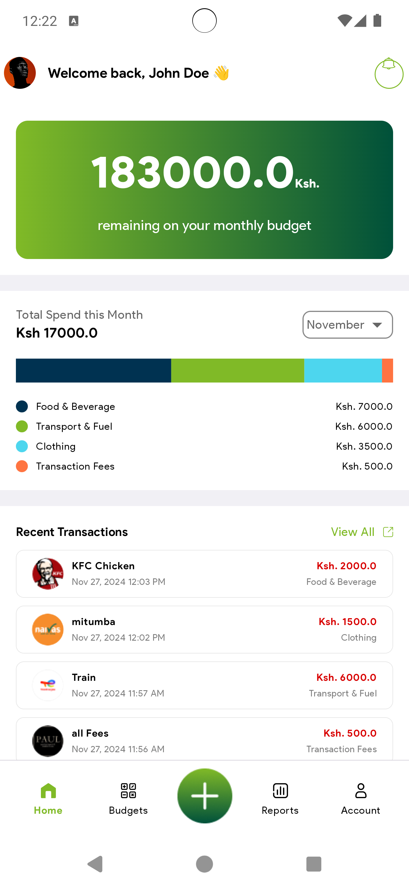

## Structural design pattern
The app is built with a Model-View-ViewModel (MVVM) pattern which is a structural design pattern that separates objects into three distinct groups:
- Models hold application data. They’re usually structs or simple classes.
- Views display visual elements and controls on the screen. They’re typically subclasses of UIView.
- View models transform model information into values that can be displayed on a view. They’re usually classes, so they can be passed around as references.

### Add Month Budget
 

### Home Screen
 

### Add Budget 

### Success Transaction

## Tech Stack.
- [Kotlin](https://developer.android.com/kotlin) - Kotlin is a programming language that can run on JVM. Google has announced Kotlin as one of its officially supported programming languages in Android Studio; and the Android community is migrating at a pace from Java to Kotlin
- [Room Library](https://developer.android.com/training/data-storage/room) - The Room persistence library provides an abstraction layer over SQLite to allow fluent database access while harnessing the full power of SQLite.
- [Android KTX](https://developer.android.com/kotlin/ktx.html) - Provide concise, idiomatic Kotlin to Jetpack and Android platform APIs.
- [AndroidX](https://developer.android.com/jetpack/androidx) - Major improvement to the original Android [Support Library](https://developer.android.com/topic/libraries/support-library/index), which is no longer maintained.
- [Viewmodel](https://developer.android.com/topic/libraries/architecture/viewmodel) -The ViewModel class is designed to store and manage UI-related data in a lifecycle conscious way
- [Kotlin Coroutines](https://developer.android.com/kotlin/coroutines) - A concurrency design pattern that you can use on Android to simplify code that executes asynchronously.
- [Hilt](https://developer.android.com/training/dependency-injection/hilt-android) -  A dependency injection library for Android that reduces the boilerplate of doing manual dependency injection in your project
- [Navigation Components](https://developer.android.com/guide/navigation/navigation-getting-started) -  Helps you implement navigation, from simple button clicks to more complex patterns, such as app bars and the navigation drawer.
- [Material Libarary](https://material.io/develop/android) -  Modular and customizable Material Design UI components for Android
- [Kotlin Flows](https://developer.android.com/kotlin/flow) - a flow is a type that can emit multiple values sequentially, as opposed to suspend functions that return only a single value.
- [Channel](https://kotlinlang.org/api/kotlinx.coroutines/kotlinx-coroutines-core/kotlinx.coroutines.channels/-channel/) - Channel is a non-blocking primitive for communication between a sender (via SendChannel) and a receiver (via ReceiveChannel).

## Setup Requirements
- Android device or emulator
- Android Studio

